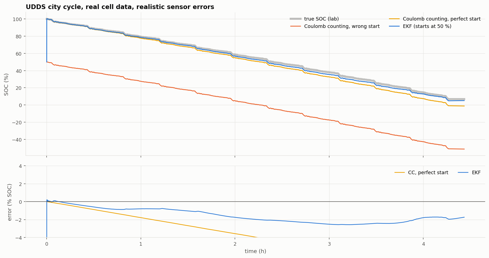
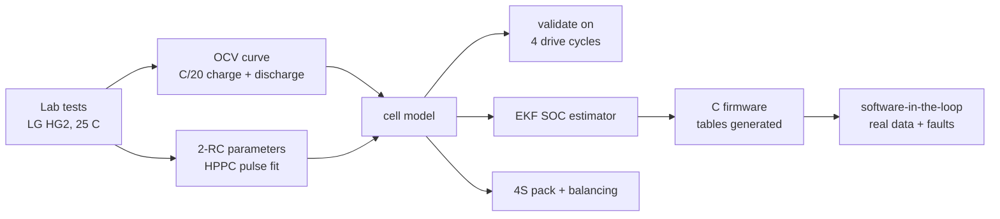
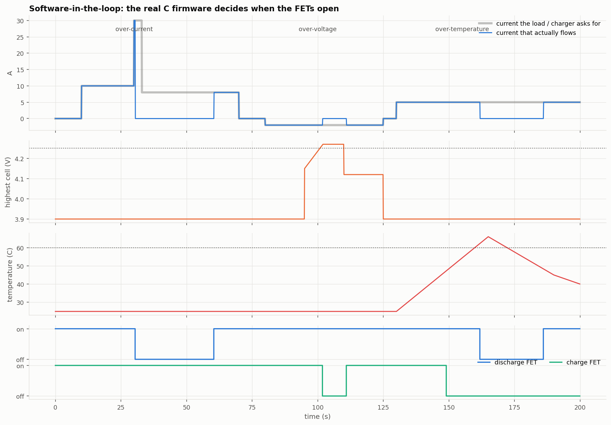

# 4S Li-ion Battery Management System

A battery management system for a 4-cell (16.8 V) pack of LG HG2 18650 cells. It is built on
**real lab data**, validated against it, and implemented as embedded C:

- a **2-RC equivalent-circuit cell model** fitted to a lab HPPC test and validated on four EPA drive-cycle tests,
- an **Extended Kalman Filter** state-of-charge estimator that stays within ~1–2 % of the truth even when it starts 40–50 % wrong and the current sensor has an offset,
- a **4-cell pack simulation** showing why passive balancing matters,
- **C firmware**: protection state machine, EKF, balancing; 24 unit tests; **software-in-the-loop** tests on recorded data and injected faults,
- a **KiCad schematic** of the analog front end (TI BQ76920) with protection MOSFETs and current shunt.



## Results at a glance

| | Result |
|---|---|
| Cell model, 4 drive cycles it was not fitted to | voltage RMSE **14.5 / 16.1 / 23.7 / 20.4 mV** (UDDS / LA92 / US06 / mixed), 5–100 % SOC |
| HPPC pulse fit | 1.5 mV mean RMSE across SOC |
| SOC estimation (EKF), starts 50 % wrong + 50 mA sensor offset | RMSE **1.78 / 1.01 / 0.96 / 1.11 %** |
| Coulomb counting with a *perfect* start, same sensor | 4.69 / 3.04 / 1.29 / 2.40 % (drifts up to −8 %) |
| EKF switched on mid-drive, 40 % wrong, flat part of the OCV curve | within 2 % SOC in 4–86 s |
| Passive balancing, 45 mA, 4 mismatched cells | SOC spread 12.8 % → 4.4 % in 8 cycles; usable capacity +3.7 % (without balancing: stuck at 12.8 %) |
| C firmware vs Python reference (same real data) | max difference **0.0067 % SOC** (single vs double precision) |
| Fault injection (SIL) | 6 / 6 trip and recovery timings match the requirements |
| Unit tests | 24 / 24; builds with `-Wall -Wextra -pedantic -Wshadow -Wdouble-promotion`, zero warnings |
| AFE schematic | KiCad ERC: 0 errors |

## The data

LG 18650HG2 test data from McMaster University (P. Kollmeyer, 2020; Mendeley Data,
doi:10.17632/cp3473x7xv.3, **CC BY 4.0**): a C/20 discharge and charge (open-circuit voltage),
an HPPC pulse test (model parameters), and UDDS, LA92, US06 and mixed drive cycles (validation),
all at 25 °C. `python data/download.py` fetches the files used here into `data/raw/`.

## How it works



**Cell model.** `v = OCV(SOC) − R0·i − V1 − V2`, where V1 and V2 are two RC voltages (time
constants ~1 s and ~30–60 s) for charge transfer and diffusion. Every parameter is a table vs
SOC. Two lessons came from validation ([fig](figures/03_model_validation.png)):

- Below ~20 % SOC the 2-RC fits ran into their parameter bounds, so those fits are dropped and the last good values are held.
- The OCV is taken from the cell's resting voltage after **discharge** (from the HPPC rests), not the average of charge and discharge. A drive cycle sits on the discharge side of the hysteresis loop. This choice halved the drive-cycle error.

**EKF.** It runs the model forward with the measured current (predict), then compares the
model's voltage with the measured one and corrects SOC by the Kalman gain (update). The
current-sensor offset that makes Coulomb counting drift is pulled back by the voltage, and a
wrong starting SOC is corrected within seconds. Mid-SOC, 1 % of SOC moves the voltage only
6–10 mV ([fig](figures/01_ocv.png)), so the filter must trust voltage carefully.

**Firmware** (`firmware/src`, hardware-independent C99):

| Module | Does |
|---|---|
| `protection.c` | over/under-voltage, discharge/charge over-current, short circuit, over/under-temperature; each with a debounce (one noisy sample can't trip it) and hysteresis or retry (it can't chatter) |
| `soc_ekf.c` | the EKF in single precision; tables generated from the Python model (`cell_tables.h`) |
| `balancing.c` | bleeds cells > 10 mV above the lowest, only while charging or resting, never two neighbours at once (BQ76920 rule) |
| `bms.c` | one `bms_step()` per sample: protection → FET commands, SOC per cell, balancing mask |



**Hardware** (`hardware/afe`): BQ76920 front end (cell voltages, coulomb counter, temperature,
hardware OV/UV/OCD/SCD, internal balancing), 43 Ω / 1 µF cell filters, VC4 tied to VC3 as the
datasheet requires for 4 cells, a 1 mΩ shunt (22 A OCD, 67 A SCD, 8.4 mA resolution),
back-to-back low-side MOSFETs, a fuse and a TVS. The schematic is generated by
`hardware/gen_afe.py` and checked with KiCad ERC.

## Reproduce

```bash
pip install -r requirements.txt
python data/download.py                  # ~9 MB of lab data
python scripts/01_build_model.py         # OCV + HPPC fit
python scripts/02_model_validation.py    # drive-cycle validation
python scripts/03_soc_estimation.py      # EKF vs Coulomb counting
python scripts/04_pack_balancing.py      # 4S pack, balancing
python scripts/05_export_tables.py       # writes firmware/src/cell_tables.h
make -C firmware test                    # C unit tests (Windows: mingw32-make)
python scripts/06_sil.py                 # software-in-the-loop
python hardware/gen_afe.py               # KiCad schematic
```

## Limitations

- Everything is at 25 °C. A production model needs parameter tables vs temperature (the dataset includes −20 to 40 °C tests).
- The drive-cycle tests were run on a different cell than the HPPC test (same model). Part of the remaining voltage error is cell-to-cell difference.
- The pack simulation's cell spread is assumed, not measured.
- The protection thresholds are firmware-level. The BQ76920's own hardware OV/UV/OCD/SCD is the faster, independent safety layer, and the firmware would configure it over I²C (not written here).
- During city driving, regen pulses up to 5.3 A exceed the 4.5 A charge limit, so this firmware would open the charge FET. A vehicle must cap regen torque at the BMS limit; this is noted as a system requirement.

## License

MIT. Cell data: CC BY 4.0, P. Kollmeyer, McMaster University.
